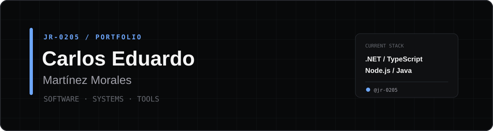

<div align="center">
  

  <br />

  <a href="https://github.com/jr-0205?tab=followers">
    
  </a>
  
</div>

## 👨‍💻 Sobre mí

Soy **Carlos Eduardo Martínez Morales**, desarrollador en formación con interés en crear soluciones claras, útiles y bien estructuradas. Actualmente estoy fortaleciendo mis bases en desarrollo web, programación, bases de datos y control de versiones.

- 🔭 Construyendo proyectos para convertir lo aprendido en experiencia práctica.
- 🌱 Profundizando en **JavaScript, desarrollo web y bases de datos**.
- 🧠 Me interesa escribir código legible, comprender el problema y mejorar continuamente.
- 🤝 Abierto a colaborar en proyectos para principiantes y aprender en equipo.
- ⚡ Mi objetivo: crecer como desarrollador y crear software que aporte valor real.

## 🧰 Tecnologías y herramientas

<div align="center">


</div>

## 🚀 En qué estoy trabajando

```text
▸ Consolidar fundamentos de programación
▸ Diseñar bases de datos claras y normalizadas
▸ Crear proyectos web completos para mi portafolio
▸ Aprender buenas prácticas con Git y GitHub
```

## 📌 Proyectos destacados

> Mis primeros proyectos públicos están en camino. Aquí mostraré trabajos que documenten el problema, las decisiones técnicas y lo que aprendí durante el proceso.

<!-- Cuando tengas repositorios públicos, reemplaza USUARIO/REPOSITORIO:
<div align="center">
  <a href="https://github.com/jr-0205/REPOSITORIO">
    
  </a>
</div>
-->

## 📊 Actividad en GitHub

<div align="center">
  
  
</div>

## 🤝 Conectemos

<div align="center">
  <a href="https://github.com/jr-0205">
    
  </a>
</div>

---

<div align="center">
  <sub>Construyendo, aprendiendo y mejorando un commit a la vez.</sub>
</div>
